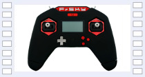
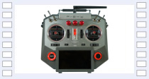
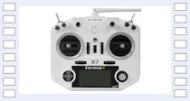
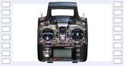
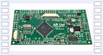
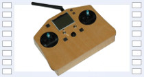
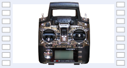
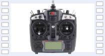
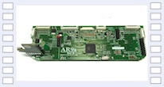
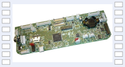



The following radios and radio boards are compatible with OpenTX. 

<table><tr><td style="width:220px"></td><td>

Game style version the Taranis: 
Black & White LCD 128x64 
4 Switches 2 x 3-position, 2 x 2-position 
No Pots 
2 Sliders 
S.Port 
Haptic vibration 
RAM  128K

</td></tr></table>

<table><tr><td style="width:220px"></td><td>

Similar to the X12S transmitter with: 
Colour outdoor TFT 480x272 
8 Switches 6 x 3-position, 1 momentary, 1 x 2-position 
3 Pots 1 x 6-position, 2 smooth 
2 Sliders 2 rear, 2 front 
2 Extra trims 
Haptic vibration 
Wireless trainer 
2 Internal antennas 
RAM 8MB

</td></tr></table>

<table><tr><td style="width:220px"></td><td>

Top of the line transmitter with: 
Colour outdoor TFT 480x272 
8 Switches 6 x 3-position, 1 momentary, 1 x 2-position 
3 Pots 1 x 6-position, 2 smooth 
2 Sliders 2 rear, 2 front 
2 extra trims 
GPS and 6 axis sensors 
Haptic vibration 
Wireless trainer 
RAM 8MB

</td></tr></table>

<table><tr><td style="width:220px"></td><td>

Smaller version of Taranis Plus with: 
Black & White LCD 128x64 
6 Switches 4 x 3-position, 1 momentary, 1 x 2-position 
2 Pots 
No Sliders 
S.Port 
Haptic vibration 
RAM  128K

</td></tr></table>

<table><tr><td style="width:220px"></td><td>

Tray version of Taranis Plus with: 
Color OLED top mounted display for basic telemetry data 
Quality 4 bearing gimbals 
Bluetooth support 
2 Additional sliders 
Safe start and safe shutdown power switch 
Haptic vibration  
Improved audio circuits 
RAM  192K
  

</td></tr></table>

<table><tr><td style="width:220px"></td><td>

New version of Taranis with:   
Haptic vibration  
Multi colored LCD background light  
Improved LCD display   
Improved audio circuits  
RAM  128K
  

</td></tr></table>

<table><tr><td style="width:220px"></td><td>

ARM Cortex M3 32-bit 120MHz   
212x64 LCD with gray scales   
60 models + infinite on SD   
9 flight modes   
Telemetry   
Advanced audio functions (voice files from SD, vario, ...)   
SD data logger   
RAM  128K
  

</td></tr></table>

<table><tr><td style="width:220px"></td><td>

ARM Cortex M3 32-bit 36MHz   
60 models + infinite on SD   
9 flight modes   
Telemetry Interface through Futaba trainer jack 
Advanced audio functions (voice files from SD, vario, ...) 
SD data logger 

</td></tr></table>

<table><tr><td style="width:220px"></td><td>

Smaller version of the AR9X board 
Upgrade option for the Flysky TH9X and Turnigy 9X 
ARM Cortex M3 32-bit 64MHz 
LCD 128x64 
6 Switched 4 x 3-position, 1 momentary, 1 x 2-position 
2 Pots, 1 with detent, 1 without detent 
LCD backlight option 
Haptic vibration option 

</td></tr></table>

<table><tr><td style="width:220px"></td><td>

Arduino (or clone) MEGA2560 16MHz   
30 models + infinite on SD   
6 flight modes   
2 rotary encoders (one can be used for navigation)  
Telemetry 
SD data logger 

</td></tr></table>

<table><tr><td style="width:220px"></td><td>

ATmega128 8-bit 16MHz   
30 models   
5 flight modes   

</td></tr></table>

<table><tr><td style="width:220px"></td><td>

Also exist as Turnigy 9X   
Atmega64   
16 models     
5 flight modes   
A lot of mods supported (audio, voice, telemetry, rotary encoder navigation, ...)   

</td></tr></table>

<table><tr><td style="width:220px"></td><td>

ARM Cortex M3 32-bit 64MHz 
LCD 128x64 
6 Switched 4 x 3-position, 1 momentary, 1 x 2-position 
2 Pots, 1 with detent, 1 without detent 
LCD backlight option 
Haptic vibration option 

</td></tr></table>

<table><tr><td style="width:220px"></td><td>

ARM Cortex M3 32-bit 36MHz   
60 models + infinite on SD   
9 flight modes   
Rotary encoder navigation   
Telemetry   
Advanced audio functions (voice files from SD, vario, ...)   
SD data logger   

</td></tr></table>

<table><tr><td style="width:220px"></td><td>

ATmega2560 8-bit 16MHz   
30 models + infinite on SD   
6 flight modes   
2 rotary encoders (one can be used for navigation)   
Telemetry   
SD data logger   

</td></tr></table>

